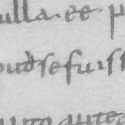
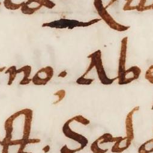
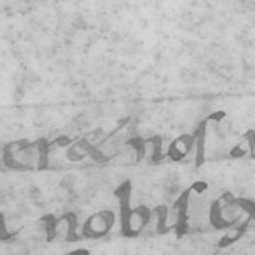
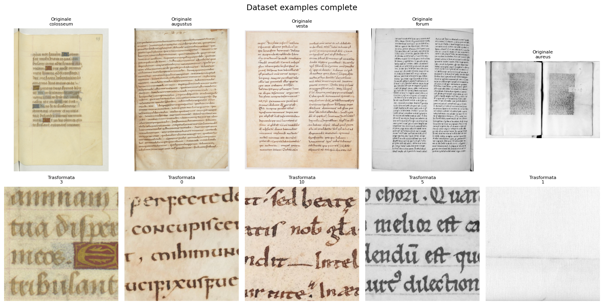
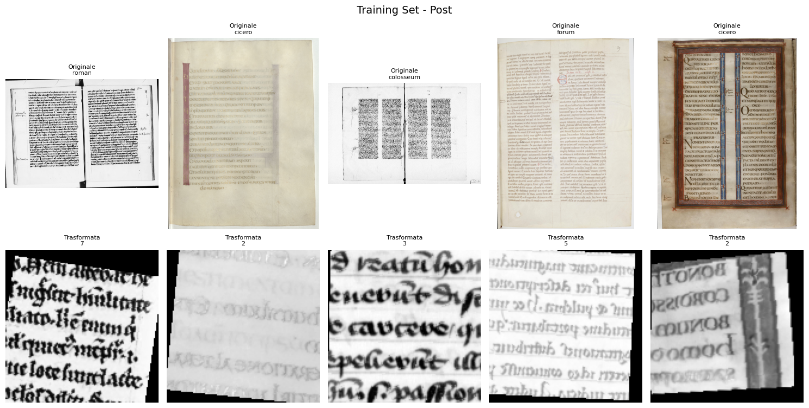
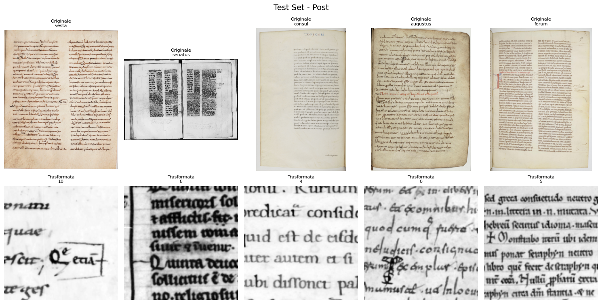
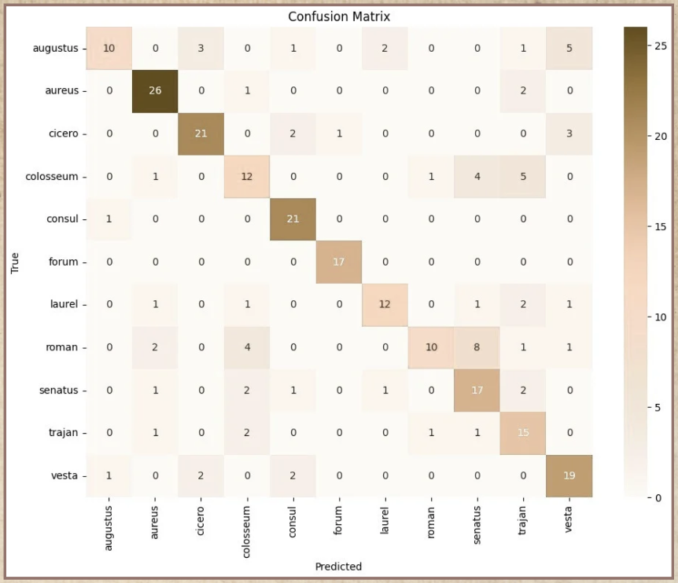

# The Librarian from Alexandria

## 👥 Team Members - AlexandriaAI
- Gabriele De Ieso
- Denise Di Franza 
- Alessia Tonicello

---

## Section 1: Introduction

This project was developed as part of the Machine Learning course at LUISS. Acting as digital archivists of the Great Library of Alexandria, our task was to design a machine learning model capable of classifying ancient digitized texts by the fonts used in their printing. These scanned pages come from various historical sources and use distinct typographic styles. 

Our goal was to automate the identification of these font styles using a neural network-based image classification system. The final model should assist in organizing and archiving ancient documents by recognizing and categorizing fonts in a scalable, reliable way.

---


## Section 2: Methods

### Dataset
The dataset consists of 1,265 scanned pages of ancient texts, each labeled with the font used. The files are stored in a CSV (`pages.csv`) referencing image files in the `img/` directory.

### 2.1 Design Choices and Key Ideas
Before training we: 
- Verified image existence by checking paths and filtering out missing or unreadable files.
- Added a binary `exist` column which flagged whether each image file was present and entries with missing images were dropped to avoid issues during training.

&nbsp;

- **Font Label Mapping**
  Since the dataset consists of font names (e.g., "cicero", "vesta") associated with each image, we mapped these strings to integer labels using a Python dictionary. We identified **11 unique fonts**, and assigned values from 0 to 10 for model compatibility:
  ```python
  Font: augustus -> Label: 0
  Font: aureus -> Label: 1
  Font: cicero -> Label: 2
  Font: colosseum -> Label: 3
  Font: consul -> Label: 4
  Font: forum -> Label: 5
  Font: laurel -> Label: 6
  Font: roman -> Label: 7
  Font: senatus -> Label: 8
  Font: trajan -> Label: 9
  Font: vesta -> Label: 10


&nbsp;


**2.1.1 Preprocessing Strategy**

The scanned pages varied in resolution and clarity, therefore, in order to standardize inputs and reduce noise, ee tested and compared multiple preprocessing pipelines. Our final steps included::
- Grayscale conversion: convert images to grayscale to reduce complexity (from 3 channels to 1), because color isn't needed for font recognition.
- CLAHE (Contrast Enhancement): to improve local contrast in noisy or unevenly lit scans
- Double-page splitting: if an image is too wide (double-page spread), we split it into two pages based on aspect ratio.
- Text patch extraction: using adaptive thresholding and a sliding window to extract 255x255 patches containing text
- Fallback center crop: used when no valid patches were found


**Text Patches Exmaples**


&nbsp;
&nbsp;
      


&nbsp;


**2.1.2 Data Augmentation (Training Set Only)**
To prevent overfitting and introduce visual variation, we implemented:
- Random Horizontal Flip (50%)
- Random Affine Transformations (rotation ±10°, translation ±10%, scaling ±10%)
- Random Perspective Distortion (scale = 0.2)
- (Optional) Random Erasing – currently disabled


&nbsp;

**2.1.3 Tensor Conversion & Normalization**
- ToTensor: converts PIL images to PyTorch tensors
- Normalization: scales pixel values to [-1, 1] using mean=0.5, std=0.5
- Validation set is only resized, normalized and converted to tensor (no augmentation).


&nbsp;

**2.1.4 Dataset Splitting Strategy**
&nbsp;
Once the images were preprocessed and transformed, we proceeded with the final step of dataset preparation: splitting the data into training and validation subsets. Given the presence of class imbalance — with some fonts being significantly less represented — it was crucial to adopt a strategy that would preserve the original class distribution across both subsets. 
To achieve this, we used StratifiedShuffleSplit from the scikit-learn library, performing a single split in which 80% of the data was allocated to training and 20% to validation. By fixing the random seed, we ensured full reproducibility of the experiment. This stratified approach guaranteed that each font class maintained roughly the same proportion in both the training and validation sets.

After splitting, we applied the appropriate transformation pipeline to each subset:
- The **training set** received the full augmentation pipeline (random flips, affine transforms, etc.)
- The **validation set** was only normalized and resized, without augmentations, to reflect real-world inference conditions

To visually inspect the quality and correctness of our splitting and transformation procedures, we generated three visual previews:

1. A full dataset sample, showing randomly selected examples prior to any transformation:

&nbsp;
&nbsp;


&nbsp;
&nbsp;

2. A training set preview, displaying patches after augmentation, to verify the effectiveness and variability introduced by our transformations;


&nbsp;
&nbsp;

3. A test set preview, confirming that only minimal, clean preprocessing was applied.



&nbsp;


**3. Model Selection**


&nbsp;
In order to address the classification of ancient fonts, we explored and compared different neural network architectures: a custom-built Convolutional Neural Network (CNN) and two pretrained models: ResNet18 and MobileNetV2. With these architectures we progressively improved the performance.

Custom CNN – Baseline Architecture:
We first designed a simple yet effective Convolutional Neural Network to serve as a baseline.

*Custom CNN (Baseline)*:
Our starting point was a simple Convolutional Neural Network composed of:
- 4 convolutional blocks, each with Batch Normalization, ReLU activation, MaxPooling, and Dropout
- 2 fully connected layers followed by a Softmax classifier for 11 font classes


&nbsp;


*EnhancedFontCNN*:
This was our first deep learning model explicitly tailored for font classification. Its architecture includes 4 convolutional layers, each followed by BatchNorm and ReLU, with MaxPooling layers to downsample feature maps and an adaptive average pooling layer to standardize feature outputs. The classifier head is composed of two dense layers with dropout and batch normalization, leading into an 11-class softmax output.

The first version was trained with:
- Fixed learning rate (1e-4)
- Adam optimizer with weight decay (1e-4)
- ReduceLROnPlateau for learning rate adaptation

&nbsp;

Later, we refined the training by:
- Using CosineAnnealingLR in combination with ReduceLROnPlateau
- Starting with a higher learning rate (1e-3)
- Introducing early stopping with a 3-epoch patience

In total, the final EnhancedFontCNN was trained for 12 epochs and achieved a best validation accuracy of 43.65%. The purpose of this model was to ensure correct image preprocessing, patch extraction, label encoding, and training loop functionality.


&nbsp;
**Pretrained Models**

&nbsp;
To improve the performance, we used pretrained ResNet18 and MobileNetV2 models, both imported from the `torchvision.models` library, which provides pretrained versions of these architectures based on the ImageNet dataset.
&nbsp;
ResNet18 (Transfer Learning):
It introduced deeper residual blocks and skip connections, which allow for better gradient flow across layers.
- All feature extraction layers were frozen
- The final fully connected layer was replaced to output 11 classes
This model generalized better than CNNs but was constrained by frozen weights. It reached ~58% accuracy before training was stopped early due to runtime limits.

&nbsp;

MobileNetV2 (Final Model):
MobileNetV2 was chosen for its efficiency its lightweight and provided the best performance.
- Pretrained on ImageNet, it was tested in multiple configurations: 
  - Frozen backbone with custom head
  - Partial unfreezing (last 2 convolutional blocks)
- Lightweight design via depthwise separable convolutions and inverted residuals
- Final head: GlobalAveragePooling → Dropout(0.4) → Linear → Output

This model achieved the highest validation accuracy (~73.4%) with partial fine-tuning and moderate augmentation. It offered an optimal trade-off between computational cost and performance.

&nbsp;
This technique, known as *transfer learning*, is particularly effective when dealing with small or medium-sized datasets, like ours. ResNet18 and MobileNetV2 were expected to extract more robust visual features and generalize better than the custom CNN.


&nbsp;


**4. Training Setup**

To ensure fair and reproducible training across both models, we adopted a consistent training pipeline, carefully chosen based on best practices in deep learning.

*General Configuration:*
- Framework: PyTorch 2.x
- Device: CUDA-enabled GPU (if available), otherwise CPU
- Seed: A fixed random seed (42) was applied across NumPy, PyTorch, and Python to guarantee reproducible results

&nbsp;

*Optimization Strategy:*
- Loss Function: `CrossEntropyLoss` weighted by inverse class frequencies to address dataset imbalance
- Optimizer: `Adam`
  - Learning rate: `1e-4`
  - Weight decay: `1e-5` (to prevent overfitting)
- Learning Rate Scheduler:
  - `CosineAnnealingLR` for smooth cyclical updates
  - `ReduceLROnPlateau` for reducing learning rate on validation plateaus

&nbsp;

*Training Conditions:*

- Batch Size: 16 (due to limited GPU memory)
- Epochs: Up to 100, with early stopping triggered by validation loss stagnation
- Precision: Mixed precision training using autocast and GradScaler to accelerate training and reduce memory usage


&nbsp;


### 2.2 Environment Reproducibility
We used Python 3.12.6 and a `venv` virtual environment to manage dependencies for this project. All required libraries are listed in the `requirements.txt` file included in the repository.

To recreate our environment and run the project:

```bash
# Create and activate the virtual environment
python3 -m venv venv
source venv/bin/activate

# Install required dependencies
pip install -r requirements.txt
```

To generate your own `requirements.txt`, use:

```bash
pip freeze > requirements.txt
```

### 2.3 Pipeline Overview
Below is a high-level flowchart of our system:

```
[ Start ]
   ↓
[ Verify dataset + remove corrupt files ]
   ↓
[ Map font names to integer labels ]
   ↓
[ Split dataset (stratified 80/20) ]
   ↓
[ Preprocessing (CLAHE, patch extraction, grayscale) ]
   ↓
[ Data Augmentation (train set only) ]
   ↓
[ Apply transforms + create datasets ]
   ↓
[ Train CNN / ResNet / MobileNetV2 ]
   ↓
[ Evaluate on validation set (metrics + confusion matrix) ]
   ↓
[ Save best model and predictions ]
```


---

## Section 3: Experimental Design

To validate our design choices and measure the performance impact of different model architectures, we conducted three structured experiments, which were designed to answer the central research question:
> How much improvement can we achieve by transitioning from handcrafted CNNs to pretrained models, and how do data augmentation and fine-tuning strategies affect performance?

Each experiment followed the same pipeline for preprocessing, stratified splitting, transformation, and training setup.

&nbsp;

1. **Experiment 1 – Custom CNN and EnhancedFontCNN**
Purpose: Establish a performance baseline and test how deepening the network affects model capability.

Baseline(s):
Custom CNN:
- Architecture: 4 convolutional blocks (Conv2D → BatchNorm → ReLU → MaxPool) followed by 2 fully connected layers
- Used to validate the end-to-end training pipeline

This model served as a foundational benchmark to validate the pipeline, confirming that preprocessing, dataset handling, and architecture integration were functioning correctly. Although it was not our final model, we observed initial learning trends and behaviors that informed improvements in subsequent versions. Based on early testing, the model demonstrated limited learning capacity, and performance metrics remained moderate, consistent with expectations for a shallow architecture. 


&nbsp;

EnhancedFontCNN:
- Built on the Custom CNN but deeper and more regularized
- Added adaptive average pooling and increased dropout
- Initially used a fixed learning rate and ReduceLROnPlateau
- Later included CosineAnnealingLR and early stopping

It was trained for 12 epochs and reached a best validation accuracy of 43.65%
  
&nbsp;

*Evaluation Metrics*:
- Accuracy: Overall classification correctness
- Confusion Matrix: Used to understand which font classes were most often confused


&nbsp;


2. **Experiment 2 – ResNet18 Transfer Learning**
Purpose: Evaluate the benefit of using a pretrained deep convolutional network on a small dataset.

- ResNet18 from `torchvision.models`, pretrained on ImageNet
- All layers frozen except the final classifier head adapted to 11 font classes

However, training had to be aborted early due to excessive runtime, and the model did not complete a full training cycle (5-epoch run interrupted). Thereofre, its heavy architecture and long training time made it unsuitable for our available hardware and we don't have results.

&nbsp;

*Evaluation Metrics*: Same as above.


&nbsp;


3. **Experiment 3 – MobileNetV2 (Partial Fine-Tuning)**
Purpose: Test whether a lightweight architecture with selective fine-tuning and strong data augmentation could outperform deeper models.

MobileNetV2 from `torchvision.models` was trained in multiple configurations:
- CPU-only (5 epochs): ~58% acc
- Partial fine-tuning (14 epochs): ~73.4% acc, ~0.70 F1
- No augmentation (10 epochs): ~71.43% acc
- Aggressive augmentation (7 epochs): peaked at ~63% acc


The best configuration proved to be partial fine-tuning with dropout(0.4) + moderate augmentation. This model achieved the best performance (up to ~73% accuracy), confirming that selective fine-tuning and data augmentation can compensate for compute limitations and dataset size. Its efficiency also made it suitable for deployment in lower-resource environments.

&nbsp;

*Evaluation Metrics*: Same as above

&nbsp;

Shared Setup Across All Experiments:
- Identical preprocessing and text patch extraction
- Same augmentation strategies (applied only to training set)
- Consistent use of Weighted CrossEntropyLoss, Adam optimizer, and learning rate schedulers
- Stratified 80/20 splits with fixed random seed
- Early stopping based on validation loss stagnation


---

## Section 4: Results

### Key Findings

EnhancedFontCNN delivered stable yet moderate results with a best accuracy of 43.65%:
- “Forum” (71% precision, 59% recall) and “Laurel” (42% precision, 79% recall) were among the best-performing classes
- Underperforming classes included “Vesta” (25% precision, 6% recall) and “Consul” (10% precision, 4% recall)
- The model improved steadily across epochs, showing consistent learning dynamics
- Confusion matrix analysis confirmed that visually similar fonts were often confused
- Misclassifications were frequent between similar-looking fonts (e.g., ceres ↔ juno), while fonts with clearer identity showed diagonal dominance in the confusion matrix

These findings supported our decision to explore transfer learning for better generalization and efficiency.

&nbsp;

- MobileNetV2 outperformed all other models
- Data augmentation proved crucial for generalization
- Class-weighted loss improved performance on underrepresented fonts

The table below provides a high-level summary of the models tested during the experimentation phase. It shows how the combination of transfer learning, fine-tuning, and careful augmentation led to significant performance improvements.

### Results Table

| Model Configuration                     | Accuracy  | Notes                                                                                  |
|----------------------------------------|-----------|----------------------------------------------------------------------------------------|
| EnhancedFontCNN                        | ~43.65%   | Deeper CNN with more layers and dropout; showed no significant improvement.           |
| ResNet18 (Frozen Backbone)             | —         | Training was aborted early due to excessive runtime; no meaningful results obtained.  |
| MobileNetV2 (Frozen Backbone)          | ~58%      | Pretrained MobileNetV2 used without fine-tuning; matched baseline performance.        |
| MobileNetV2 (No Data Augmentation)     | ~71.43%   | Partial fine-tuning without any data augmentation; strong but slightly less robust.   |
| MobileNetV2 (Aggressive Augmentation)  | ~62%      | Used heavy augmentation; performance decreased due to excessive visual distortion.    |
| MobileNetV2 (Final Model)              | **~73.4%**| Best setup: partial fine-tuning, moderate augmentation, dropout(0.4).                |


### Confusion Matrices

Included in /images/:
- confusion_matrix_mobilenet.png
- 

&nbsp;

Insights:
- Strong diagonals in most classes
- Frequent misclassifications:
    - augustus ↔ cicero
    - colosseum ↔ trajan, roman ↔ senatus


---

## Section 5: Conclusions 

### What We Learned
Through this project, we observed that transfer learning greatly improves model performance when dealing with limited or noisy data. Models like ResNet18 and especially MobileNetV2 allowed us to leverage high-quality pretrained features, resulting in faster convergence and better accuracy compared to models trained from scratch.

We also confirmed that data quality and robust preprocessing steps (such as contrast enhancement, patch extraction, and text normalization) have a significant impact on final results. Similarly, strategic data augmentation (flipping, affine transformations, perspective distortion) proved essential in helping the model generalize to new, unseen samples.

Finally, we found that lightweight models like MobileNetV2 strike a great balance between computational efficiency and predictive power, making them an excellent choice in resource-constrained environments.

&nbsp;

### Limitations
Despite the encouraging results, our work faced several limitations. The dataset was highly heterogeneous, with many scanned pages affected by noise, inconsistent lighting, and varying layouts (e.g., single vs. double-page spreads). These issues sometimes led to difficult font distinctions.

Additionally, some fonts were underrepresented in the dataset, which limited the model's ability to learn those classes effectively—even with class-weighted loss. Finally, hardware limitations prevented us from running more exhaustive hyperparameter tuning or fully unfreezing larger backbones.

&nbsp;

### Future Work
Looking ahead, there are several directions that can be explored. First, experimenting with more advanced architectures—such as Transformers or modern CNN variants—could lead to further performance gains. Another promising choice is the integration of denoising autoencoders or layout normalization techniques, which could mitigate some of the visual inconsistencies found in the scans.

We also plan to expand the dataset by generating synthetic examples for rare fonts or collecting more real scans. Lastly, we aim to apply automated hyperparameter optimization (e.g., with Bayesian search or Hyperband) to better tune our training settings and potentially unlock additional performance.


